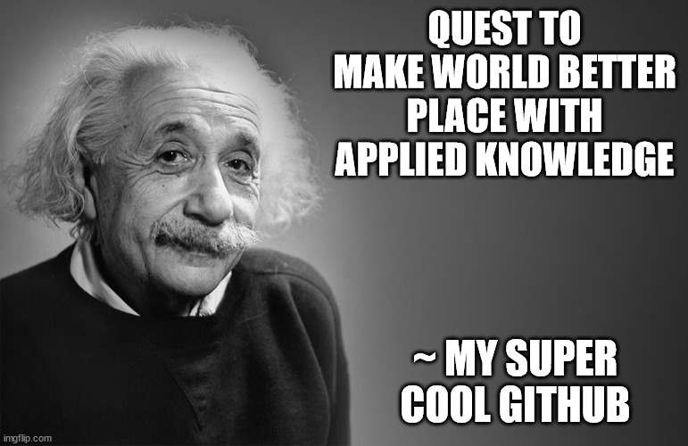

### Hi there, I am Heikki, enthusiastic learner. Just adding this and moving along 👋

 and  and last update on front page was 

Currently, focusing on!  :hammer::fire::green_book:

  

## 🌱 Some learning platforms 

 

### Programming/Scripting languages

- Level 3 

- Level 2 

")

, Course experience")

- Level 1 

### Tools/Frameworks/Libraries

, Course Experience, School Experience, Book Experience")

")

 

- ⚡ About me

<!-- Using Latex syntax to write with colors -->

$$
\textbf{Sports:} \space {\color{green}Gym/Walking} \space over \space{\color{red}Intense sports}
$$

$$
\textbf{Work Values:} \space {\color{green}Collective/Synergy} \space over \space{\color{red}Competition}. \space \textbf{As long} \longrightarrow In \space tech, \space \\ 
there \space is  \space too \space much \space information \space for \space one \space to \space rule.
That \space being \space said, \space you \space should \space try \space your \space best, \space since \space you \space were \space accepted \space in \space the \space first \space place.
$$

$$ 
{\color{green}Easy \space Going} \space over \space{\color{red}High \space Energy}. \space \textbf{As long} \longrightarrow  You \space did \space or \space try \space the \space thing \space what \space you \space were \space given.High \space energy \space focus \space has \space its \space place \space nonetheless!
$$

  

 
