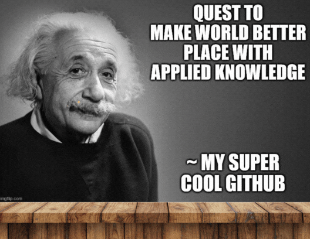

  
  

   and last update on front page was 

  

  Currently, focusing on!  :hammer::fire::green_book:
  
  
  
  
   
  
  <!-- FIURE OUT here br   -->

  

## ⚡ About me.

$$
\textbf 
{ Work Values: }
$$

$$ 
{ \color{ green }Collective/Synergy } \space over \space 
{ \color{ red } Competition }. \space \textbf 
{ As long } \longrightarrow
$$

$$
In \space tech, \space \\ 
there \space is  \space too \space much \space information \space for \space one \space to \space rule. \newline
That \space being \space said, \space you \space should \space try \space your \space best, \space since \space you \space were \space accepted \space in \space the \space first \space place.
$$

$$ 
{ \color{green}Easy \space Going } \space over \space 
{ \color{red}High \space Energy }. \space \textbf
{ As long } \longrightarrow
$$

$$
You \space did \space or \space try \space the \space thing \space what \space you \space were \space given. High \space energy \space focus \space has \space its \space place \space nonetheless!
$$

$$
\textbf 
{ Sports: }
$$

$$
{ \color{ green } Gym/Walking } \space over \space
{ \color{ red } Intense \space sports }
$$

$$
\textbf
{ Learning Syle: }
$$

$$
{ \color{green} Systematic \space Approach } \space over \space 
{ \color{red} Material \space Is \space Trivial/Scattered }
$$

$$
{ \color{green} Applied \space Learnig  \space Style } \space over \space 
{ \color{red} The \space Academic \space In\space Papers \space Way }. \space \textbf
{ Note } \longrightarrow
$$

$$
{ These \space both \space are \space good. \space Just \space picked \space my \space favorite. }
$$

## 🌱 Some learning platforms 

## Consumer of:

## Getting into soon:

  
Remember to check website!

  

  

  
  
Also, remember to drop feedback!

  
  

  

 
